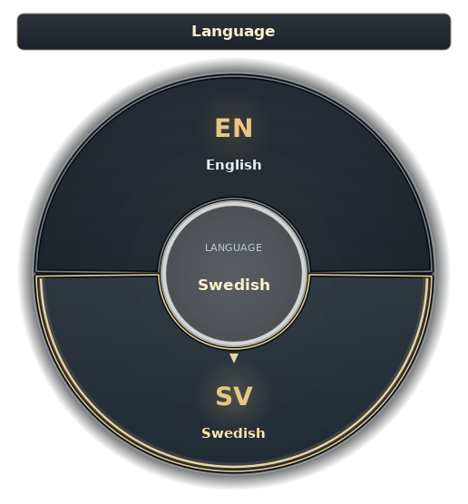
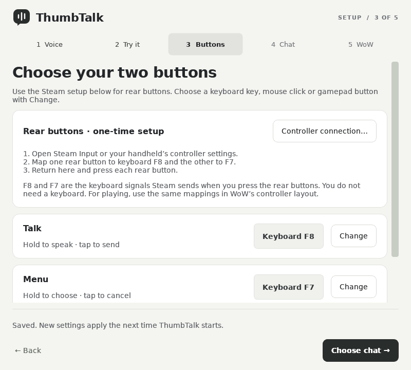

<p align="center">
  
</p>

<h1 align="center">Hold. Speak. Review. Send.</h1>

<p align="center">
  Voice-to-chat for World of Warcraft, built for controller and handheld players.<br>
  Speak your message. Review the words. Choose when to send.
</p>

<p align="center">
  <strong>Free to use</strong> &nbsp; · &nbsp;
  <strong>Local speech recognition</strong> &nbsp; · &nbsp;
  <strong>Your language</strong> &nbsp; · &nbsp;
  <strong>Your controls</strong>
</p>

<p align="center">
  <a href="#get-started"><strong>Get started</strong></a> &nbsp; / &nbsp;
  <a href="#controls">User guide</a> &nbsp; / &nbsp;
  <a href="#troubleshooting">Troubleshooting</a> &nbsp; / &nbsp;
  <a href="#support-thumbtalk">Support the project</a>
</p>

---

## Chat without reaching for a keyboard

ThumbTalk turns your voice into a local review line in WoW’s chat history before sending. A companion app handles
speech and controls; a small addon connects it to the game. Set it up for Retail,
Classic, or a beta client, and install the addon into each version you play.

| Speak your way | Stay in control |
| :--- | :--- |
| **Your words, on your device.** Local recognition without a transcription account, API key, or subscription. | **Review before sending.** Hold Talk, speak, release, and check the draft. Tap to send or cancel. |
| **A short list of languages.** Put your favorites in the radial menu and switch while playing. | **Buttons that suit you.** Keyboard keys, mouse clicks, controller buttons, and combinations. |
| **The right conversation.** Say, Party, Raid, Guild, Instance, whispers, General, Trade, and LFG. | **A quieter screen.** Show speech status only when needed, move it, or hide it. The radial stays available. |

## Made for thumbs

<table>
  <tr>
    <td align="center" width="42%">
      <br>
      <strong>Your favorites, one stick away</strong><br>
      <sub>Choose your own languages in setup.</sub>
    </td>
    <td align="center" width="58%">
      <br>
      <strong>Choose the buttons you already use</strong><br>
      <sub>Keyboard, mouse, or controller.</sub>
    </td>
  </tr>
</table>

The radial uses large segments, clear labels, and a gold selection marker.
Hold **Menu**, point the **right stick**, and release to choose.
**B** goes back; **LB/RB** above the wheel changes channel pages.
A light stick movement selects a segment; return to center between menu levels.
[See all controls →](#controls)

## Get started

**[Download ThumbTalk 0.8.0 · build 1](https://github.com/AlexanderCGKarlsson/thumbtalk/releases/tag/v0.8.0)**

**0.8 is the preview/beta series.** Windows handheld verification is still in
progress. **1.0 is reserved for stable.** These packages include the companion,
matching addon and runtime; no Python installation or GitHub account is needed.
Speech models download separately during setup and run locally afterward.

| Platform | Download | Installation |
| :--- | :--- | :--- |
| **Linux / SteamOS** | [Complete installer ZIP](https://github.com/AlexanderCGKarlsson/thumbtalk/releases/download/v0.8.0/ThumbTalk-0.8.0-build1-linux.zip) | Extract the entire ZIP and open its `Install-ThumbTalk.desktop` |
| **Windows** | [Setup installer](https://github.com/AlexanderCGKarlsson/thumbtalk/releases/download/v0.8.0/thumbtalk-windows-setup.exe) | Run the installer and leave **Open ThumbTalk** selected |
| **Windows portable** | [Portable ZIP](https://github.com/AlexanderCGKarlsson/thumbtalk/releases/download/v0.8.0/thumbtalk-windows-x86_64.zip) | Extract everything; run `ThumbTalk/thumbtalk.exe --setup` |

Windows and Linux packages target Intel/AMD x64. Linux needs X11 or XWayland;
native Wayland-only input is not supported. macOS currently runs from source.
Android and ARM packages are not available.

If Linux opens the desktop file as text, open a terminal in the extracted folder
and run `bash install-local.sh`. The complete ZIP includes the app files.
Separate online installers on the release page download this same version.
GitHub's **Source code** archives are for development, not app installation.

<details>
<summary><strong>Verify your download</strong></summary>

Each package has a matching `.sha256` file on the release page. Download both.
On Linux, run this in the download folder:

```sh
sha256sum -c ThumbTalk-0.8.0-build1-linux.zip.sha256
```

On Windows PowerShell, compare these values, ignoring letter case:

```powershell
(Get-FileHash .\thumbtalk-windows-setup.exe -Algorithm SHA256).Hash
Get-Content .\thumbtalk-windows-setup.exe.sha256
```

The Windows installer is unsigned. A checksum verifies the download's contents;
it is not a signing certificate. Do not disable Windows security globally.

</details>

### Set up your voice and buttons

1. **Voice:** choose your microphone and spoken language. Start with Whisper Small.
   On SteamOS, try **System microphone · recommended** when available.
2. **Try it:** start the voice test, tap **Record**, speak, then tap **Stop recording**.
   Use **Listen to recording** to check the microphone. No touchscreen holding is needed.
3. **Buttons:** choose Talk and Menu with **Change**. Learn keyboard, mouse or
   gamepad buttons; hold a combination together and release to learn it.
4. **Chat:** choose the channel, review or immediate sending, and optional whisper recipient.
5. **WoW:** select your game client and **Install addon**. Repeat for every Retail,
   Classic or beta client you play, then follow the connection instructions below.

**Next** saves each step. Choose **Save & finish** when done. After updating,
install the matching addon again and fully restart WoW.

<details>
<summary><strong>SteamOS / Linux: connect WoW and configure both layouts</strong></summary>

In the WoW setup step, copy the Steam launch option into **Properties → Launch
Options** of the entry you actually start: **World of Warcraft**, or **Battle.net**
if that is how you launch WoW. Each shortcut has separate launch options and
controller mappings. Keep required existing launch options and `%command%`.
With another Linux launcher, start **ThumbTalk for WoW** before the game.

For rear buttons, suggested mappings are **L5 → F8 (Talk)** and **R5 → F7 (Menu)**.
Set them in Steam's **Non-game controller layout** for desktop setup, and again
in the **running game's controller layout**. Match those keys in ThumbTalk.
Check both layouts after applying a community profile. Other handhelds may use
different names for their rear buttons.

</details>

<details>
<summary><strong>Windows handhelds: Armoury Crate and automatic startup</strong></summary>

**Steam Input is not required.** In Armoury Crate SE or your device's controller
app, assign the rear buttons primary keyboard actions, such as F8 and F7.
On an Ally, clear **Set as Secondary Function** for a button that needs its own
key action. Use a held key assignment rather than a timed macro. Check the
profile used in setup and the profile used in WoW.

Use **Gamepad / Spillkontroller** mode while playing. Return to ThumbTalk's
**Buttons → Change → Listen for a button…**, press each button and save.
Start **ThumbTalk for WoW**, keep it running, and launch WoW through Battle.net.

Enable **Start with Windows** in the WoW setup step to launch the companion
minimized at sign-in. It is optional and off by default. Download your model and
save microphone/button settings first. For a portable copy, keep its folder in
place or turn startup off and back on after moving it.

</details>

## Controls

| Record | Review | Accept | Discard |
| :--- | :--- | :--- | :--- |
| Hold **Talk**, speak, then release | Read **ThumbTalk: …** in WoW's local chat history | Tap **Talk** again | Tap **Menu** |

The review is visible only to you. Accepted messages go to the selected channel.
Choose **Sending → Send immediately** to skip review. Setup also offers toggle
recording and separate Confirm/Cancel buttons. B/Circle discard is optional and
**off by default**, because that button may already have a gameplay action.

Hold **Menu** when no draft is pending to choose **Language**, **Channels**,
**Speech model**, or **Sending**. Point the right stick at a category, return to
center, then point at a choice. Release Menu to apply it. **LB/RB** above the
wheel changes channel pages; **B** or right-stick click goes back. D-pad/arrow
keys cycle choices, and Talk enters a category. Keep the stick mapped as a
joystick, not as mouse movement, for radial navigation.

The channel wheel includes Say, Party, Raid, Guild, Instance, latest whisper,
and a configured recipient. Its second page offers General, Trade and LFG.
Public channels must be joined and available in WoW. Latest whisper uses `/r`,
so an incoming whisper can change the recipient; choose a named recipient for
a specific person. Keep messages short: the current chat-line limit is 255 bytes,
including the destination command.

**Setup → Chat → On-screen display** controls status visibility and position.
Choose **Hidden** to hide the status box; local chat review and the radial stay
available. Downloaded speech models and sending mode can be switched in-game
without reloading WoW. F11–F14 are reserved for the addon connection.

> **Preview limitations:** the native chat box can remain open or contain text,
> and simultaneous gameplay buttons can interfere with delivery. Automatic chat
> closing and uninterrupted controller input are not yet guaranteed. Chat-style
> switching is disabled following reported freezes. “Send requested” is not
> confirmation that the WoW server accepted a message. [Troubleshooting →](#troubleshooting)

## Local speech, with room for your game

**Whisper Small** is the default based on our Ally voice tests. It runs on the
CPU with INT8 inference and two inference threads. Only one model stays loaded.
Your GPU remains available to the game; performance still depends on the device
and workload.

| Model | Role | Language selection | When to choose it |
| :--- | :--- | :--- | :--- |
| **Whisper Small** | **Default** | Manual or automatic; includes Norwegian | Start here; best results in our Ally voice tests so far |
| Whisper Base | Optional | Manual or automatic; includes Norwegian | Try a lighter model and compare recognition on your device |
| Whisper Tiny | Optional | Manual or automatic; includes Norwegian | Smallest Whisper option; accuracy can be limited |
| Parakeet V3 | Experimental | Automatic only; 25 languages, **no Norwegian** | Compare with Whisper using the same recording |

Download the models you want, compare the same recording, and choose from those
already installed. The in-game **Speech model** menu switches downloaded models
without reloading WoW; **Sending** selects review or immediate sending. These
menu changes apply to the next recording.
Choose a fixed spoken language for more consistent short
messages with Whisper. **Parakeet V3 uses Automatic only** in the in-game language
menu: it detects 25 supported languages, including English and Swedish. Norwegian
is not supported by this Parakeet model; choose Whisper for Norwegian. See
[NVIDIA’s supported languages](https://huggingface.co/nvidia/parakeet-tdt-0.6b-v3).

- Audio is processed on your device; it is not sent to a transcription service.
- The microphone stays open during a session so speech can start with the button press.
  Audio outside recordings is immediately discarded.
- Voice-test recordings stay in memory until replaced or the test stops.
- ThumbTalk transcribes the language you speak; it does not translate into English.


## Linux and Windows settings

The 0.8.0 build 1 Windows and Linux packages use the same Setup screens and saved
preferences on both platforms:

| Configuration | Linux / SteamOS | Windows |
| :--- | :--- | :--- |
| Whisper Small, Base, Tiny; Parakeet V3; model downloads | Yes | Yes |
| Spoken language and favorite languages | Yes | Yes |
| Microphone selection, level check, tap-to-record voice test | Yes | Yes |
| Keyboard, Mouse 4/5, gamepad bindings; hold or toggle recording | Yes | Yes |
| Channels, whisper favorites, review or immediate sending | Yes | Yes |
| Radial choices, optional B/Circle discard, overlay visibility/position | Yes | Yes |
| Addon installation for each WoW client; update checks | Yes | Yes |
| Automatic startup | Steam launch option | Start with Windows |

Windows handheld rear buttons may need assignments in Armoury Crate or the
device's controller app; Steam is optional. Model language rules apply equally
on both platforms. Configuration parity is covered by automated tests; live WoW
review/send behavior still needs Windows device verification because text
delivery differs by platform.

## Updates

Choose **Check for updates** at the top of Setup. Preview versions (0.x) include
published betas and stable releases; versions 1.0 and later check stable releases
only. Drafts are excluded. Checks are manual, include no audio or settings, and
open GitHub for you to download an update; nothing is installed automatically.

Close WoW and ThumbTalk before updating. Install the companion and matching
addon together, then restart WoW. Preferences stay outside the app folder.
[All releases and release notes →](https://github.com/AlexanderCGKarlsson/thumbtalk/releases)

## Troubleshooting

| Symptom | What to check |
| :--- | :--- |
| **Ready, but neither Talk nor Menu reacts on SteamOS** | Check ThumbTalk's saved keys against the **running game's** Steam layout. Restart WoW and the companion; if needed, reboot the handheld. A reboot restored this on our SteamOS Ally; the cause is unconfirmed. |
| **Mouse 4 is learned as Mouse 5** | This has been reported on a SteamOS Ally. Test the physical buttons with temporary letter bindings in a text editor to separate left/right mapping from mouse numbering. Match the actual signal in both Steam layouts, or use spare keyboard keys. Do not assume L5/R5 must be swapped. |
| **Windows rear buttons are not detected** | Assign primary keyboard actions in Armoury Crate or the device's controller app, then learn those keys in ThumbTalk. Steam is optional. |
| **WoW works directly, but ThumbTalk is missing through Battle.net** | Put the launch option on the **Battle.net Steam shortcut** too, and check its active controller layout. The addon being enabled does not mean the companion is running. |
| **The radial is missing** | Start the companion, confirm the Menu binding, and check for reset keybindings. Hidden status does not hide the radial. |
| **Camera moves while the radial is open** | Update the addon for the client you launched. Use joystick axes for the right stick, not an “As Mouse” mapping. Remove conflicts on reserved F11–F14. |
| **Poor recognition or buzzing microphone** | Use the tap-to-record test and listen back. Check the recording device and its input volume, then test Whisper Small with your spoken language selected. A different model cannot repair distorted audio. |
| **Fontconfig errors on Linux** | Update the companion, which bundles compatible font rules. Do not edit `/etc/fonts`. A warning before “Ready” alone does not establish startup failure. |
| **X11 connection broke after switching modes** | Gaming Mode and Desktop Mode use different display sessions. Restart ThumbTalk in the current session. |
| **Chat stays open, abilities trigger, or X opens chat channels** | This remains an open issue. Close manual drafts before recording and avoid overlapping inputs during delivery. Check the actual conversation and clear partial drafts before retrying; ThumbTalk does not automatically resend. |
| **Review fails, WoW freezes, or Blizzard blocks an addon action** | Update both components and fully restart WoW. If it recurs, stop that test and report the version, client and operation. Capture any automatic diagnostic; do not repeatedly run `/tt` or chat-style commands on a client where they freeze. Immediate mode is an alternative if it works on your device. |
| **Say appears in Darnassian** | That is the character's in-game language within Say, separate from the recognition language. Choose the faction language in WoW if desired. |

Settings: **Windows** `%APPDATA%\thumbtalk\settings.json`; **Linux**
`${XDG_CONFIG_HOME:-~/.config}/thumbtalk/settings.json`. Restart the companion
after changing saved bindings. In-game menu choices save for the next launch.
The Linux companion log is `${XDG_STATE_HOME:-~/.local/state}/thumbtalk/companion.log`.

[Report a bug](https://github.com/AlexanderCGKarlsson/thumbtalk/issues/new/choose)
with your device, OS, WoW client, version/build, sending mode and reproduction
steps. Remove private chat and account details from logs or screenshots.
For vulnerabilities, use [private reporting](https://github.com/AlexanderCGKarlsson/thumbtalk/security/advisories/new).

<details>
<summary><strong>Run from source and contribute</strong></summary>

Use Python 3.12 and [uv](https://docs.astral.sh/uv/):

```sh
uv sync --project helper --python 3.12 --group build --frozen
uv run --project helper python helper/thumbtalk_cli.py --setup
```

`run-helper.sh` and `run-helper.ps1` use the same locked environment. Source is
in `helper/`; the WoW addon is `addon/ThumbTalk/`. Run the Python tests with
`uv run --project helper python -m unittest discover -s tests -v`
(`QT_QPA_PLATFORM=offscreen` for headless execution). Lua addon fixtures and
native installation checks run in GitHub Actions. Build on Windows or Linux with
`uv run --project helper python packaging/build.py`.

Passing automated checks does not establish live WoW compatibility. Test the
matching companion/addon on the affected client before claiming a chat fix.

</details>

## Support ThumbTalk

ThumbTalk is free to use. Help improve it by testing on your handheld, reporting
clear bugs, suggesting improvements, or sharing it with someone who plays on a controller.

Optional contributions support development. They do not unlock features or
change access to the addon. Support links belong here on the project page;
ThumbTalk does not show donation requests in-game.

<p>
  <a href="https://buymeacoffee.com/acgk"></a>
</p>

<details>
<summary><strong>Or support with USDC</strong></summary>

**Ethereum · Base · Arbitrum · Robinhood Chain · HyperEVM**

ENS: `acgk.eth` · Wallet address:

```text
0xe423b19262ea8fbc68ab9509f90080ab6aa1930b
```

**Solana**

```text
6NYUp38rWL1Zz6xCyhvUdmSs3AaVfHCRQ7rEtiCQrQjp
```

Send USDC using the matching network and address above.
Contributions are entirely optional and do not unlock any features.

</details>

Support requests stay on this project page, as described in [Blizzard's addon policy](https://eu.forums.blizzard.com/en/wow/t/wow-user-interface-add-on-development-policy/1642).

## Built with the community

ThumbTalk started from [GamepadSpeak by kubeden](https://github.com/kubeden/gps)
and has been substantially rewritten. Thank you to kubeden for the original
voice-to-chat and WoW integration. This repository begins with the current
ThumbTalk 0.8.0 build 1 snapshot; prior development commits are not included.

Thank you to [silverfoxy for Decktation](https://github.com/silverfoxy/decktation).
Its sending tests and Linux clipboard/virtual-keyboard approach informed our WoW
delivery work. ThumbTalk's integration is independent; no Decktation source code
has been copied. Bundled [ydotool](https://github.com/ReimuNotMoe/ydotool) includes
its AGPLv3 license, complete source and rebuild script. Bundled xclip also includes
its corresponding source and notices in [packaging/third-party](packaging/third-party).

The radial takes visual inspiration from
[ConsolePort](https://www.curseforge.com/wow/addons/console-port), using ThumbTalk's
own vector symbols. ThumbTalk does not bundle ConsolePort or WoW artwork and is
not affiliated with or endorsed by Blizzard Entertainment.

<details>
<summary><strong>Speech libraries and model credits</strong></summary>

Whisper recognition uses [faster-whisper](https://github.com/SYSTRAN/faster-whisper).
The optional NVIDIA [Parakeet TDT 0.6B V3](https://huggingface.co/nvidia/parakeet-tdt-0.6b-v3)
model is licensed under [CC BY 4.0](https://creativecommons.org/licenses/by/4.0/).
ThumbTalk downloads the [INT8 ONNX conversion by csukuangfj](https://huggingface.co/csukuangfj/sherpa-onnx-nemo-parakeet-tdt-0.6b-v3-int8)
and runs it with [sherpa-onnx](https://github.com/k2-fsa/sherpa-onnx) (Apache 2.0).
Conversion and quantization change the model representation; no endorsement by
NVIDIA or the converter is implied. Models are downloaded separately.

</details>

## License and privacy

GamepadSpeak's upstream redistribution terms remain unresolved; no project-wide
open-source license is claimed. Origin credit and dependency licenses are
retained in [third-party notices](THIRD_PARTY_NOTICES.md). A fresh repository
history does not change that status.

ThumbTalk has no analytics service and does not upload speech for transcription.
See [Privacy and local data](PRIVACY.md) for microphone use, clipboard handling,
local files and model/update downloads.
